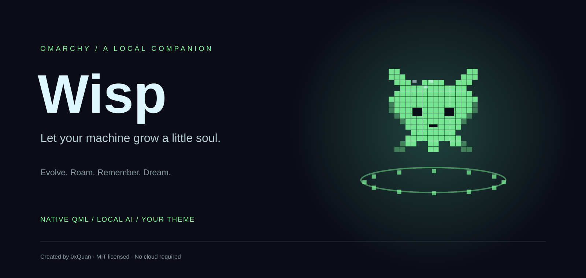
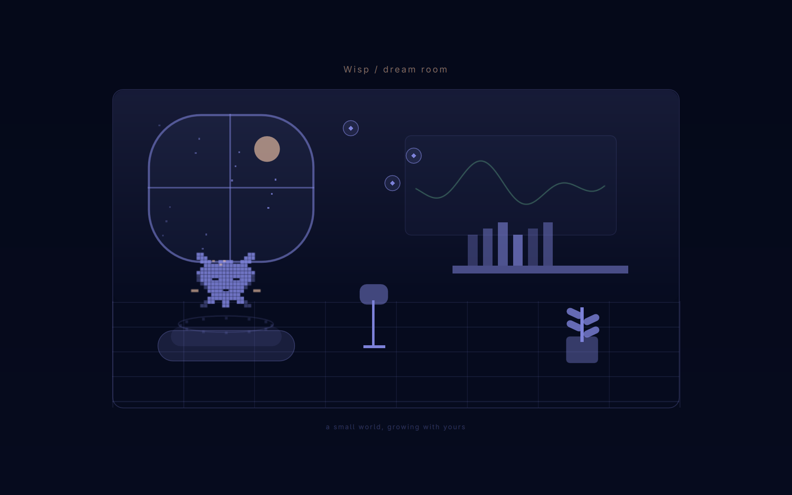
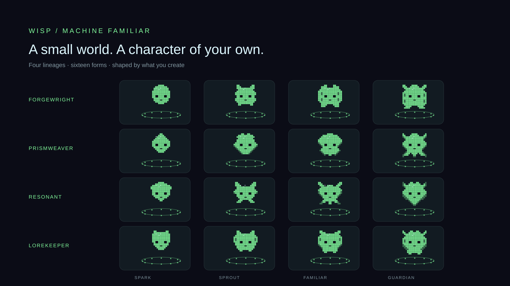

<p align="center"></p>

# Wisp · a machine familiar

A native Omarchy companion that grows with the things you make. It roams your desktop, remembers a little context, keeps a pocket room, and dreams in your current theme. Every installation gets its own persistent markings and editable identity.

**No browser runtime. No cloud account. No mandatory AI.** Quickshell draws the companion; small Python helpers run when needed. Ollama supplies optional local conversation, naming, and room choices.



*Dream-room preview uses sample state; no personal notes or identity are included.*

## Meet your familiar

- **Four evolution classes, sixteen silhouettes:** Forgewright, Prismweaver, Resonant, Lorekeeper.
- **A quiet desktop presence:** the orbital ring communicates mood and activity; names and status live in the popup.
- **An identity of its own:** age, name, personal influences, class selection, portable/stationary details, and exportable themed SVG portrait.
- **Roam, Follow, or Stay:** movement yields to dragging, hover, chat, and room interaction.
- **A pocket room:** nest, notes, fireflies, garden, local-AI activity choices, and bond-earned furnishings.
- **A native dream-room screensaver:** the same room and character, fullscreen across your displays, with Omarchy’s existing lock timing preserved.
- **Optional local chat and voice:** bounded desktop action proposals, seven-second offline dictation, and opt-in spoken replies.



## Shared life with your machine

Open **More → Settings** to opt in. Wisp samples the active app identity and workspace about once a minute while you are active and on external power. It remembers a bounded local activity diary and category-level sampled active time, and uses that context in chat. Existing project/file-change observations continue to shape evolution. Recognized creative-app use contributes 1 XP per 30 sampled active minutes, at most 4/day within the shared 24 XP daily cap; gaps are not backfilled. Categories are authored approximations, and uncategorized apps earn no activity XP. Expressions also respond to the sampled activity category.

A settled moment can prompt a short, useful command tip or an aside from the selected local model, at most once every 20 minutes. The built-in tips work without AI: they use only the permitted app category, rotate recent suggestions, and offer an exact example for an available desktop command. A tip never executes its command automatically: its action button opens a chat proposal for an explicit **Run**. The thought appears in a speech bubble beside Wisp without stealing keyboard focus or entering chat history. Wisp stays still while it is visible; hover to keep it open, expand longer text with **Read more**, or choose **Dismiss**. Casual thoughts are not duplicated as system notifications. **Settings → Preview bubble** shows an authored preview without AI or a history entry. The Thoughts panel keeps its app source and timestamp. Model asides interpret metadata; authored command tips explain fixed desktop controls. Neither provides screen understanding or measurements of your feelings/productivity. No screenshots, typed text, clipboard, passive microphone, browser history or process command lines are collected. Optional window-title context is separately controlled and off by default. Hyprland returns a complete active-window record; unused fields (including titles in metadata-only mode) are discarded immediately, before persistence or model input.

Ambient observation/generation pauses on battery, power saver, idle, lock, fullscreen, Do Not Disturb, quiet pause, hidden Wisp, or heavy CPU load. Unknown desktop/lock signals keep it quiet. Foreground chat cancels the ambient client; model calls share a lock, and background requests use two threads, a 30-second HTTP timeout and no model keep-alive. Results are discarded if power, consent or the foreground window changes. The shell suppresses asides during direct interaction with Wisp. Use **Pause 1h**, **Awareness off**, or **Privacy and data → Forget activity and thoughts** whenever wanted. Forgetting clears the diary, reflections and activity aggregates (including backups), preserving earned identity/XP and daily reward limits.

**Commands** exposes the actual fixed action catalogue and missing executables. Common supported requests route directly without relying on model judgment, while more varied language uses the catalogue in the model prompt. Tools still require Run and report their actual result; the model cannot execute arbitrary commands. Workspace navigation uses the current Omarchy/Hyprland Lua dispatch API. Media controls use Omarchy’s native media service and report unhandled actions; no playerctl dependency is needed. Obsidian and Do Not Disturb are included when available.

## Command center (1.4)

Open **Commands** directly from chat. Search by task or example, filter categories, and inspect what is available on your machine. Each card explains the action and gives a phrase to try. Themes and supported plugins from your personal bank appear alongside built-in controls. **Ctrl+F** focuses search; **↑/↓** browses results; **Enter** prepares the selected command. Preparation never executes it: review its readable name in chat, then **Run** or **Cancel**. Failed actions remain available to retry. The availability filter checks required executables, not attached hardware or guaranteed success.

New controls include window focus/swap/fullscreen/floating, workspaces 1–10 and moving windows between them, scratchpad, monitor focus, microphone mute, keyboard lighting, explicit night-light and Bluetooth states, screenshots/OCR/QR selection, and default-app menus. Window operations affect the window focused when Run is pressed; closing may prompt its app to save work. Native menu choices and asynchronous service requests report acceptance rather than claiming the requested downstream work is already complete.

Exact percentages are parsed separately, without AI or adding hundreds of numeric copies to the phrase count:

- **“Set volume to 35 percent”** — default audio output, 0–100%.
- **“Set brightness to 60%”** — focused display, 1–100%.
- **“Move this window to workspace five”** — a fixed, bounded workspace action.
- **“Turn off my microphone”**, **“turn on night light”**, **“show clipboard history.”**

Chat distinguishes **No AI needed** from **Local AI** replies. If local conversation is unavailable, Wisp offers supported command examples and points to Commands. The growing bank covers explicit supported desktop tasks; it is not arbitrary shell execution or universal control of every application's internal UI. Publishing, deleting files, resetting configuration, and installing packages are not inferred from broad requests. Installation/update/power menus let the user choose their native next step.

## Nuanced requests and local clarification (1.5)

After the exact phrase and installed-target routes, a small intent parser combines a supported operation, target, and qualifier. **“Bring the Bluetooth settings up,” “turn my speaker volume down one step,”** and **“turn the night light back on”** can be understood locally without listing every wording separately. A new interpretation prepares a readable **Run** preview.

If you say **“close it,”** Wisp asks which target and offers up to four numbered choices. Click one, type **“second one”** or **“2,”** or type its exact label to prepare the command. **“Cancel”** clears the choices. Choosing an option never executes it. The short follow-up uses only the current on-screen choices and clears when the interaction changes.

Conflicting interpretations ask rather than pick by pattern order. Meaningful source, timing, amount, negation and playback-preservation constraints cannot be silently dropped. Missing tools get a local explanation. Broader conversation still uses the model. There is no automatic alias learning or transcript collection in this layer. See [intent routing](docs/INTENT-ROUTING.md) for extension contracts and tests.

## Local multi-step requests (1.6)

**“Open the browser and the terminal,” “open files then lower the volume,”** and **“open settings and mute the audio”** prepare a numbered plan without calling a model. Up to four explicit steps can be joined with **and**, **then**, or **but**; an **and** target list can share its opening verb. Tap **Run plan** to execute the reviewed sequence.

Every step must resolve to a supported fixed action before a plan is offered. Unknown targets, ambiguous pronouns, conditions, conflicting instructions, and unsupported operations get a local explanation with no partial execution. Focus-dependent window actions and toggles require separate requests. Named themes and discovered plugin panels remain individual commands for now.

Plans expire after five minutes, can run once, and stop at the first failed step with a completion summary. Preparing a newer plan replaces the older one. Cancel clears the preview. Availability is checked before execution, but runtime failures can still occur; completed steps are not rolled back or retried. Ordinary conversation still uses local AI.

Source-specific media integrations can provide reviewed fixed actions and an adapter that starts a source muted before audio is loaded. Generic system mute is never substituted for an unsupported source-specific mute request. These integrations depend on the installed player; public Wisp does not assume a particular cartoon or radio plugin exists.

## Everyday commands and your personal bank (1.3)

Common requests use a deterministic phrase bank before Ollama. No model is needed for **“change my theme,” “change wallpaper,” “open audio settings,” “show keyboard shortcuts,” “clipboard history,” “keep my computer awake,”** or **“show the bar.”** Public Wisp keeps the existing **Run** review step. A theme request without a name opens the native chooser; **“change my theme to Tokyo Night”** offers that exact installed theme. Background, font, app, plugin, default-app, learning, capture, recording, install, update and power menus are included. Opening a menu does not choose its options for you.

The built-in bank contains 22,179 unique normalized whole-utterance phrases for 112 actions. Polite wrappers are supported; quoted, negated, conditional, delayed and compound prose does not match a built-in command. **“Turn on night light”** and **“turn off night light”** request explicit states; **“toggle night light”** remains a separate operation. Unsupported wording still uses normal chat. Say **“list commands”** for the fixed catalogue.

The everyday-language pass adds 215 reviewed phrases across 77 actions: **“turn the music down a bit,” “bring up my folders,” “change the colour theme,” “let me choose which speakers to use,”** and **“restore normal idle behaviour.”** UK/US spelling, contractions, and plain descriptions are supported where the requested action is clear. Named themes also accept **“apply the Tokyo Night theme”**; supported plugin panels accept **“show me the weather plugin”** using their installed names. These are exact requests, not guesses from complaints such as “I cannot hear.”

A built-in metadata scanner runs during development installation and on first enable/restore for normal `omarchy plugin add` installations. It discovers installed theme directories and plugin manifests from Omarchy’s system and user directories. It does not import plugin code, execute manifest commands, inspect conversations, call a model, install anything, or send inventory over the network. Matching refreshes this bounded inventory, so later additions and removals are picked up too. Supported enabled `panel`, `overlay` and `menu` plugins gain exact **“open <name>”** phrases; bar-only/service plugins remain visible in the inventory because their click behavior is not guaranteed to open a panel. The desktop must accept a panel request before Wisp reports it accepted.

Say **“scan plugins,” “list my plugins,”** or **“list themes.”** You can also run the scanner directly:

```sh
python3 ~/.config/omarchy/plugins/oxquan.pixel-spirit/plugin/command_bank.py scan
```

Development copies installed by `install.py` have a flat layout: omit `/plugin` from that path. The generated bank lives in `~/.local/state/pixel-spirit/generated-command-bank.json` (or the XDG state root). It is rebuilt from metadata, never trusted as executable input. Scans examine at most 512 plugin manifest candidates (256 reserved for user plugins), 512 theme entries per root and 128 KiB per JSON input. Malformed metadata is skipped. Duplicate names pointing at different targets are omitted; built-in phrases take precedence. Each execution revalidates the installed target, so stale Run buttons cannot invoke a removed theme or plugin. Plugin enabled state is checked from configuration and ultimately by the running shell.

Optional personal aliases belong in the separate `personal-command-bank.json`, which rescans and upgrades preserve:

```json
[
  {"phrase": "use my evening colors", "kind": "theme", "target": "tokyo-night"},
  {"phrase": "open my weather panel", "kind": "plugin", "target": "example.weather"}
]
```

Only discovered themes and supported enabled panels are valid targets; aliases cannot supply commands or arguments. These example targets must exist on your own machine. This bank is local to each installation and is not shipped or synced with Wisp. No new daemon, cloud service, or package dependency is added.

## Mouse, activity and reminders

### Mouse and activity responses (1.2)

**More → Settings → Mouse and activity responses** has two independent opt-ins. Both require Awareness on and external power; new installations default to off.

- **Mouse gestures:** wiggle the pointer beside Wisp (within 260 logical pixels). Several substantial direction changes within 1.8 seconds produce a short playful tilt and expression, with a 20-second cooldown. Ordinary sweeps, tiny jitter and large monitor jumps are rejected. Reuses the existing cursor helper at most every 150 ms while active; it does not interfere with dragging or enable Follow mode.
- **Activity responses:** after 45 seconds without a 12-second input pause, Wisp stops roaming and suppresses casual AI asides. A pause releases that quiet state. Returning after an observed minute of idle can produce a happy tilt, at most once every five minutes. This is general input activity, not typing detection, emotion inference, or a productivity score.

These responses are authored animations: no model requests, XP rewards, saved input history, or keystroke capture. The gesture buffer contains at most 14 coordinate samples from the last 1.8 seconds; general activity timers remain only in memory. Disabling awareness, turning off the feature, hiding Wisp, quiet pause, or battery mode clears the relevant transient state. Fullscreen, open companion panels, and busy operations suspend reactions. A read-only desktop check samples lock, DND and load every five seconds; results expire after eight seconds and unknown signals keep responses quiet. Idle notifications alone do not reveal what was typed.

### Timers and reminders (1.2)

Open **More → Timers / Reminders**, choose 1–1440 minutes, optionally enter a message, and select **Set reminder**. Presets, a live countdown, and individual cancellation are included. The upcoming list shows Omarchy reminders on this desktop, including ones created elsewhere.

Chat recognizes explicit requests such as **“remind me in 10 minutes to check the oven”** or **“set a timer for 25 minutes”** and opens a prefilled form for review. This routing does not use a model or schedule anything until Set reminder is selected. “Show my reminders” proposes the reminder panel through the usual Run control. Dates, recurring reminders, and arbitrary time phrases are not parsed.

Omarchy's existing systemd user timers deliver the desktop notification independently of Wisp, including while Wisp is hidden or reloaded. Timers last for the login session and are not reboot-persistent. Timing follows native systemd scheduling accuracy; notifications honor Omarchy's DND behavior. Reminder messages are handed to the native reminder command and stored in its runtime message files until delivery or cancellation. No additional reminder daemon is installed.

## A quieter companion UI

Chat keeps its main controls in one place: **Chat / Room / Self / More**. Commands is directly accessible beside Chat, Room and Self. More holds Thoughts, Settings, Growth, voice and clear/hide actions. Opening a panel closes the previous one. Thoughts shows recent comments first; activity logs and settings details expand only when needed. Self groups naming, influences, lineage previews and local-model controls into expandable sections. The room puts its artwork and activities first, with notes and room details tucked below. Controls use the native Omarchy button and border styles.

## Request privacy

Wisp sends helper requests through an anonymous stdin pipe, never process arguments or environment variables. Each request is one newline-terminated JSON array, limited to 64 KiB including its delimiter. The helper rejects malformed frames, invalid command shapes, and legacy argv requests before dispatch. Chat, room notes, identity settings, speech, and saved state all use this channel; eSpeak also receives speech through stdin.

## Install

Requires **Omarchy Quattro with shell plugins**, Quickshell with `FloatingWindow.fullscreen` and AppId support, and **Python 3.11+**. Hyprland supplies pointer coordinates. Core play, identity, and evolution work without Ollama or speech packages.

```sh
omarchy plugin add https://github.com/0xQuan93/omarchy-pixel-spirit.git --enable
```

The bar’s small robot icon recalls the companion. If newly added QML components do not appear, run `omarchy restart shell`. This briefly reloads the shell.

For a development checkout, `python3 install.py` copies user-owned plugin files and updates only its entries in `shell.json`, backing up changes. The installer does not install packages, download models, or enable screensaver integration automatically.

### Optional local AI and voice

Run Ollama locally on `127.0.0.1:11434` and pull a suitable model, for example `ollama pull qwen3.5:4b`. In **Self**, enter another installed model if preferred. `PIXEL_SPIRIT_MODEL` overrides this setting. Model downloads are deliberately separate from plugin installation.

```sh
omarchy pkg add espeak-ng whisper-cpp
python3 ~/.config/omarchy/plugins/oxquan.pixel-spirit/tools/fetch_voice_model.py
```

The downloader fetches the pinned ~75 MiB English Whisper tiny model to `~/.local/share/pixel-spirit/ggml-tiny.en.bin` and verifies its SHA-256. It does not bundle the model into the plugin.

**Mic · 7s** records, counts down, transcribes locally, and puts text in the input for review. Press Send afterward. **Voice on** enables eSpeak NG replies. No passive microphone listening. Recognition quality depends on the microphone and tiny English model.

### Optional automatic dream room

First preview it from **Self → Preview dream room**. Any key, click, scroll, or pointer movement dismisses the screensaver after a short pointer grace period.

```sh
python3 ~/.config/omarchy/plugins/oxquan.pixel-spirit/setup_screensaver.py
omarchy restart shell
```

This explicitly clones the installed `omarchy.idle` service using Omarchy’s clone command, then changes only the clone’s screensaver launch command. It uses the existing `org.omarchy.screensaver` application ID, so Omarchy still observes window opening and dismissal. Lock timing, idle inhibitors, screensaver-off and stay-awake settings remain under Omarchy’s idle service. It refuses to overwrite an unrelated existing idle clone. No packaged Omarchy files are changed.

The clone should be reviewed after Omarchy updates because it is a user-owned copy. Automatic triggering honors **Stay awake**: turn that mode off through Omarchy when you want normal idle screensaving. This is a screensaver, not a replacement lock screen.

## Interact

| Gesture / control | Result |
|---|---|
| Single click | Open chat after the 400 ms multi-click window |
| Triple-click | Heart reaction and a daily pat reward |
| Drag | Reposition; roaming pauses for ten seconds |
| Right-click | Hide; recall from the bar |
| Self | Name, age, mood, class, influences, local model, portrait, screensaver |
| Name me | Local model chooses a name; rename again any time |
| Growth | Inspect observed work and earned XP |
| Room | Enter the pocket room; movement pauses while it is open |
| Drop text / `.txt` / `.md` | Add a small local note to the room shelf |
| Catch three sparks | Earn the daily firefly reward |
| Wisp chooses / Choose activity | Local model picks rest, read, play, or garden |

**Ring language:** idle breathes slowly; thinking uses a faster double orbit; working uses a bright segmented orbit; reading uses four alternating markers; playing scatters lively particles; happy uses bright markers and hearts; sleeping dims and stills the ring. Idle expressions are presentation, not background screen interpretation.

Room bond is separate from work XP. Pat, note, fireflies, rest, read, play, and garden each earn at most one bond point per local day. A plant unlocks at 3, a lamp at 8, and a crown at 16. No decay, hunger, streak penalties, or lost progress for resting. Automatic room choices never earn points.

## How it becomes yours

The first metadata scan establishes a starting character with **zero retroactive XP**. Thereafter, observed source/creative/writing-file changes and local Git-ref changes contribute capped growth. Auto class blends trait scores with chosen influences; manual class selection changes the lineage while preserving earned stage and XP.

| Influence | Class | Spark → Sprout → Familiar → Guardian |
|---|---|---|
| Maker | Forgewright | Rivet → Circuit cub → Forgewright → Iron aurora |
| Artist | Prismweaver | Dewdrop → Petal sprite → Prismweaver → Aurora manta |
| Musician | Resonant | Pulse → Echo fox → Resonant → Celestial ray |
| Archivist | Lorekeeper | Mote → Paper owl → Lorekeeper → Astral owl |

Stages unlock at **0 / 24 / 80 / 180 XP**. Random per-install markings persist across renames. Device personalization checks only whether a battery device exists; no serial numbers, machine IDs, biometrics, or hardware fingerprints are collected. An optional existing `USER.md` can seed explicitly mentioned music/art interests. You can change those influences in Self; they are aesthetic inputs, not personality diagnoses.

Default observation root is **`~/Work`**. Configure `PIXEL_SPIRIT_WORK` in the shell environment for another project folder; `PIXEL_SPIRIT_MEMORY` defaults to `<work>/Agent-Memory`. Without those folders the familiar still works and starts without a file-based imprint. Each installation uses only its own local state—no author memory or profile is shipped.

## Persistence and recovery

Identity (name, markings, age, class, influences and model), evolution XP/traits/journal, room bond/notes, recent conversation, and position/preferences survive shell restarts, reboots, and plugin upgrades in the user state directory. Startup restores saved state before showing a form or accepting changes; a failed restore shows an error and retries instead of displaying a fresh companion. The desktop, Self panel, room, portrait and screensaver use the same saved identity and evolution.

Writes are atomic and flushed to disk, with a private `.bak` recovery copy. A damaged or missing primary file falls back to the last valid backup (which may be one save behind). If neither copy can be read, Wisp preserves the files and reports the problem instead of silently resetting. Explicit chat/shelf clearing also clears the corresponding backup contents. To carry a familiar to another machine, copy the entire `pixel-spirit` state directory while Wisp is stopped; state is local and does not automatically sync between machines.

After upgrading an already-running development copy, run `omarchy restart shell` to clear cached QML components. A hot reload alone can mix an old helper caller with new Python code.

## Data, capabilities, and cost

- **Observation:** up to 16,000 entries, five directory levels and 32 repos per scan, with a four-second soft traversal budget; up to 1,000 shared-memory note metadata records. Dot directories, dependencies, builds, models, symlinks and this plugin’s source are excluded. Scans occur every ten minutes on AC, thirty on battery/power-saver; manual Growth scans have a one-minute minimum interval. Budget-limited scans are labelled.
- **Evidence, not attribution:** file changes earn 1 XP, HEAD changes 3, upstream-ref changes 2. Opt-in creative-app presence earns up to 4/day; all sources share a 24/day cap. These observations can include pulls, checkouts, clones or collaborator work. Upstream changes do **not** prove a push. No background fetch occurs.
- **Memory for chat:** bounded excerpts from optional `MEMORY.md`, `USER.md`, `Soul.md`, up to two filename-matched session notes, recent evolution metadata and up to three short room-note excerpts. These go only to local Ollama as fallible, untrusted context. The plugin never writes to the shared vault.
- **Controls:** explicit proposals for opening browser/terminal/files, volume, brightness, media playback, workspace navigation and power profiles. A Run button executes fixed argument lists. No arbitrary model-generated shell commands, deletion, publishing, or message sending.
- **Private state:** `~/.local/state/pixel-spirit/` (or XDG state root) holds identity, position, room, recent chat and evolution metadata. Chat Clear preserves identity/growth. Empty shelf deletes room notes. Notes are limited to 12 × 4096 characters. Temporary audio is removed after transcription. Private requests travel over stdin, not process arguments.
- **Resources:** native rendering; short-lived Python helpers. AC motion ~30 Hz, battery ~10 Hz; sprite animation ~12.5 Hz, battery 4 Hz. Hidden animation stops. AI uses four threads on AC, two on battery/power-saver; keep-alive is two minutes AC and zero eco. Room AI chooses every three minutes AC / ten eco only while the room is open and otherwise idle. CPU inference can still take minutes and several GB of RAM. The dream room uses no AI inference.
- **Displays:** roaming and interactive panels use the first display; the screensaver creates one fullscreen window per display. Physical multi-monitor behavior has not been tested on the author’s one-display setup.

Plugins run with your normal user permissions in Omarchy’s shell. There is no network listener; the only routine network request is local Ollama chat. The optional model download is explicit. Artwork is original and generated from the shipped silhouettes.

## Commands and removal

```sh
omarchy shell pixel-spirit show
omarchy shell pixel-spirit hide
omarchy shell pixel-spirit reset
omarchy shell pixel-spirit identity
omarchy shell pixel-spirit room
omarchy shell pixel-spirit journal
omarchy shell pixel-spirit awareness
omarchy shell pixel-spirit tools
omarchy shell pixel-spirit settings
omarchy shell pixel-spirit previewBubble
omarchy shell pixel-spirit dismiss
omarchy shell pixel-spirit roam stay   # or roam / follow
omarchy shell pixel-spirit screensaver
omarchy shell pixel-spirit status
```

If you enabled the dream-room integration, restore its launcher **before** removing the plugin:

```sh
python3 ~/.config/omarchy/plugins/oxquan.pixel-spirit/setup_screensaver.py --remove
omarchy plugin remove oxquan.pixel-spirit
omarchy restart shell
```

The restored idle clone remains installed. The restore tool refuses to overwrite subsequent edits to it. Private companion state and the separately downloaded model are retained for deliberate cleanup. For a copied development install, use `python3 install.py --remove` instead of the plugin removal command.

## Development

Input/reminder validation: `python3 -m unittest discover -q` and `node test_input_rhythm.js`. The JavaScript tests exercise the same transient detector used in QML: gesture rejection, cooldowns, bounded storage, continuous-activity thresholds, idle returns and missing-sample gaps.

```sh
python3 -m unittest discover -s . -v
omarchy plugin validate .
python3 tools/build_artwork.py
```

Tests cover action allowlisting, audio validity, evolution caps/deduplication, notes, bond, identity validation, persistence and all sixteen distinct silhouettes. Live checks covered Omarchy loading, local chat, room choice, self-naming, identity and room rendering, and native fullscreen screensaver launch/dismissal. Not every hardware/audio combination or long idle-to-lock transition has been tested.

Built by **0xQuan**. [MIT license](LICENSE). Model and speech-engine licenses belong to their respective upstream projects. [Omarchy plugin guide](https://omarchy.org/manual/shell-plugins/) · [Marketplace publishing guide](https://plugins.omarchy.org/publish.html).
